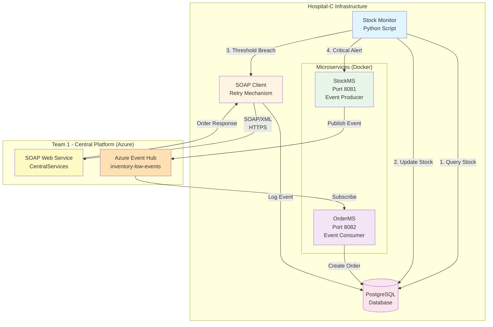
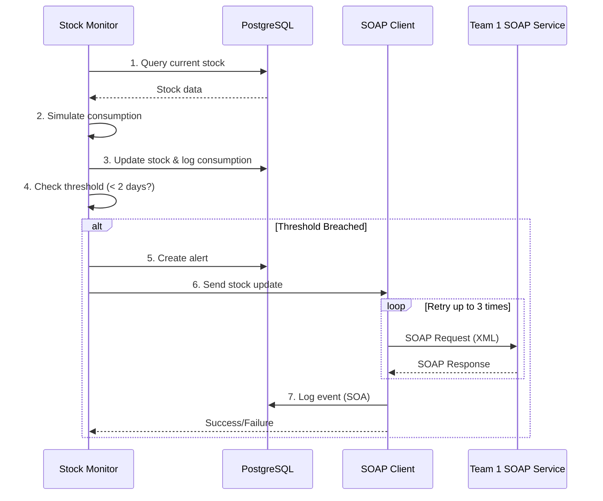
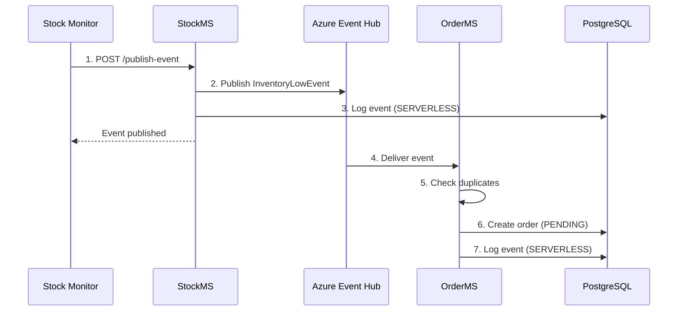
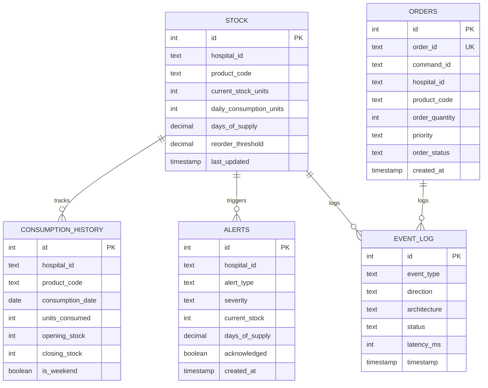
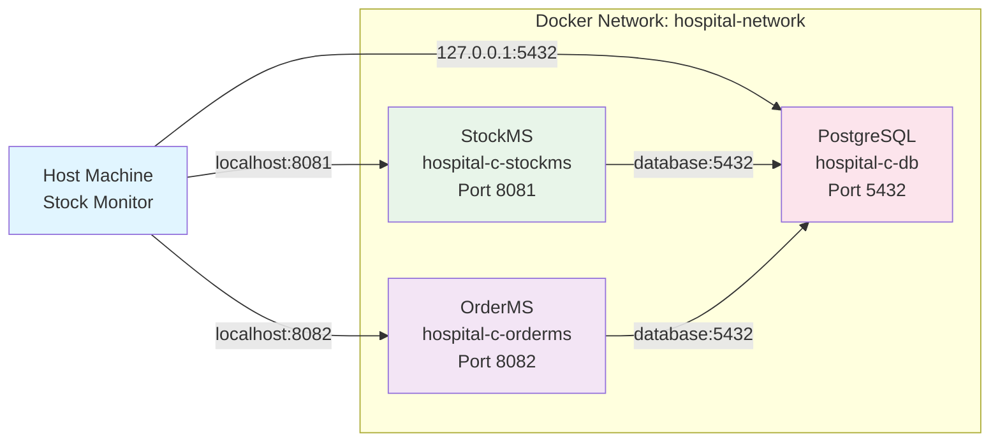

# Hospital-C Supply Chain Architecture

## 📐 System Architecture Overview

This document describes the hybrid SOA + Serverless architecture implemented for Hospital-C's medical supply chain management system.

---

## 🏗️ High-Level Architecture



---

## 🔄 System Components

### 1. Stock Monitor (Core Component)
- **Technology**: Python 3.11
- **Function**: Continuous stock level monitoring
- **Interval**: 10 seconds (demo mode)
- **Responsibilities**:
  - Simulate daily consumption with variance
  - Calculate days of supply
  - Detect threshold breaches (< 2 days)
  - Trigger SOAP calls when critical
  - Log consumption history

### 2. SOAP Client (SOA Path)
- **Technology**: Python requests + XML
- **Protocol**: SOAP 1.1 over HTTPS
- **Features**:
  - Retry mechanism (3 attempts: 5s, 15s, 30s)
  - Latency tracking
  - Event logging (SOA architecture)
- **Endpoint**: Team 1 Azure Web Service
- **Namespace**: `http://hospital-supply-chain.example.com/soap`

### 3. StockMS Microservice (Serverless Path)
- **Technology**: Flask + Azure Event Hubs SDK
- **Port**: 8081
- **Function**: Event Producer
- **Event Type**: `InventoryLowEvent`
- **Features**:
  - Publishes to Azure Event Hub
  - Logs events with SERVERLESS tag
  - Health check endpoint

### 4. OrderMS Microservice (Serverless Path)
- **Technology**: Flask + Azure Event Hubs SDK
- **Port**: 8082
- **Function**: Event Consumer
- **Event Type**: `OrderCreationCommand`
- **Features**:
  - Subscribes to Event Hub
  - Duplicate detection (orderId + commandId)
  - Order status management

### 5. PostgreSQL Database
- **Technology**: PostgreSQL 15 (Alpine)
- **Tables**: 5 (stock, orders, event_log, consumption_history, alerts)
- **Constraints**: 11 CHECK constraints
- **Indexes**: 22 custom indexes (composite, partial, time-based)
- **Volume**: Persistent storage with Docker volume

---

## 📊 Data Flow Architecture

### SOA Path (Synchronous)



### Serverless Path (Asynchronous)



---

## 🗄️ Database Schema

### ER Diagram



---

## 🔐 Security Considerations

### Environment Variables
- Database credentials stored in `.env` file
- Azure connection strings (separate configuration)
- No hardcoded secrets in source code

### Network Security
- Docker bridge network isolation
- PostgreSQL not exposed externally (only localhost)
- HTTPS for Team 1 SOAP communication

### Data Integrity
- 11 CHECK constraints enforce valid data
- UNIQUE constraints prevent duplicates
- Transaction logging for audit trail

---

## 📈 Performance Optimizations

### Database
- **22 Custom Indexes**: Optimized for common queries
- **Partial Indexes**: Only index critical records (e.g., days_of_supply < 3)
- **Composite Indexes**: hospital_id + product_code queries

### SOAP Client
- **Connection Pooling**: Reuses HTTP connections
- **Retry Strategy**: Exponential backoff (5s, 15s, 30s)
- **Latency Tracking**: Monitors response times

### Microservices
- **Health Checks**: Docker Compose dependency management
- **Event Batching**: Potential for batch publishing (future)
- **Duplicate Detection**: Prevents redundant orders

---

## 🐳 Docker Architecture



### Container Details
- **database**: PostgreSQL 15-alpine with health checks
- **stockms**: Python Flask app (depends on healthy database)
- **orderms**: Python Flask app (depends on healthy database)
- **Volumes**: `postgres_data` for persistent storage

---

## 🔧 Technology Stack

| Component | Technology | Version | Purpose |
|-----------|-----------|---------|---------|
| Database | PostgreSQL | 15-alpine | Data persistence |
| Backend | Python | 3.11 | Core logic |
| Web Framework | Flask | 2.3+ | Microservices |
| SOAP Client | requests + xml.etree | - | SOA integration |
| Event Hub | azure-eventhub | 5.11+ | Serverless integration |
| Container | Docker Compose | 3.8+ | Orchestration |
| Database Driver | psycopg2-binary | 2.9+ | PostgreSQL connectivity |

---

## 📝 Configuration Management

### Environment Variables (.env)
```env
# Database
DB_HOST=127.0.0.1
DB_PORT=5432
DB_NAME=hospital_db
DB_USER=postgres
DB_PASSWORD=postgres

# Hospital
HOSPITAL_ID=Hospital-C
PRODUCT_CODE=PHYSIO-SALINE-500ML
THRESHOLD=2.0

# Team 1 Integration
SOAP_STOCK_UPDATE_URL=https://team1-central-platform-eqajhdbjbggkfxhf.westeurope-01.azurewebsites.net/CentralServices
EVENT_HUB_CONNECTION_STRING=<from Team 1>
EVENT_HUB_INVENTORY_LOW=inventory-low-events
```

---

## 🚀 Deployment Architecture

### Development Environment
- Local Docker Compose setup
- Stock Monitor runs on host (for easy debugging)
- PostgreSQL exposed on localhost:5432

### Production Considerations
- Move Stock Monitor into Docker container
- Use Docker secrets for sensitive data
- Implement log aggregation (ELK stack)
- Add monitoring (Prometheus + Grafana)
- Scale microservices horizontally

---

## 📊 Monitoring & Observability

### Event Logging
All system events logged to `event_log` table with:
- Architecture type (SOA/SERVERLESS)
- Direction (INBOUND/OUTBOUND)
- Latency measurements
- Success/failure status

### Performance Metrics
- Average latency by architecture
- Success rate comparison
- Event throughput
- Database query performance

### Health Checks
- PostgreSQL: `pg_isready` every 10s
- StockMS: `/health` endpoint
- OrderMS: `/health` endpoint

---

## 🔄 Integration Points

### Team 1 Central Platform
- **SOAP Service**: `https://team1-central-platform-eqajhdbjbggkfxhf.westeurope-01.azurewebsites.net/CentralServices`
- **WSDL**: Same URL + `?wsdl`
- **Event Hub**: `inventory-low-events`
- **Protocol**: SOAP 1.1 (SOA), AMQP over WebSocket (Serverless)

### External Dependencies
- Team 1 SOAP service availability
- Azure Event Hub connectivity
- Internet access for HTTPS communication

---

## 📚 References

- COMP 464 Course Requirements
- Team 1 Integration Guide
- PostgreSQL 15 Documentation
- Azure Event Hubs Documentation
- Docker Compose Specification

---

**Document Version**: 1.0
**Last Updated**: 2026-01-08
**Author**: Team 4 - Hospital-C
