# Hospital-C Sequence Flow Documentation

## 🔄 Complete System Interaction Flows

This document provides detailed sequence diagrams for all critical system interactions in the Hospital-C supply chain management system.

---

## 📋 Table of Contents

1. [Stock Monitoring Cycle](#1-stock-monitoring-cycle)
2. [SOA Path - SOAP Request Flow](#2-soa-path---soap-request-flow)
3. [Serverless Path - Event-Driven Flow](#3-serverless-path---event-driven-flow)
4. [Database Operations](#4-database-operations)
5. [Error Handling & Retry Logic](#5-error-handling--retry-logic)
6. [Complete End-to-End Flow](#6-complete-end-to-end-flow)

---

## 1. Stock Monitoring Cycle

### Overview
The Stock Monitor runs continuously, checking stock levels every 10 seconds and simulating daily consumption.


### Key Calculations

**Daily Consumption Simulation:**
```python
variance = random.uniform(-0.15, 0.15)  # ±15%
consumption = base_consumption * (1 + variance)

if is_weekend:
    consumption *= 0.7  # 30% reduction

if random.random() < 0.05:  # 5% spike probability
    consumption *= 1.5
```

**Days of Supply:**
```python
days_of_supply = current_stock / daily_consumption
threshold_breached = days_of_supply < 2.0
```

---

## 2. SOA Path - SOAP Request Flow

### Overview
When stock falls below threshold, the system sends a synchronous SOAP request to Team 1's central platform.

```mermaid
sequenceDiagram
    participant SM as Stock Monitor
    participant SOAP as SOAP Client
    participant DB as PostgreSQL
    participant T1 as Team 1 SOAP Service

    rect rgb(255, 250, 230)
        Note over SM,T1: SOA Path - Synchronous Communication

        SM->>SOAP: send_stock_update(stock_data)
        activate SOAP

        SOAP->>SOAP: create_soap_envelope()<br/>Build XML with namespaces

        Note over SOAP: XML Structure:<br/>soap:Envelope<br/>  tns:StockUpdate<br/>    tns:request<br/>      stock:fields

        loop Retry up to 3 attempts
            SOAP->>SOAP: Record start_time

            SOAP->>T1: POST /CentralServices<br/>Content-Type: text/xml<br/>SOAPAction: StockUpdate
            activate T1

            alt Success Response
                T1-->>SOAP: 200 OK<br/>SOAP Response XML
                deactivate T1
                SOAP->>SOAP: parse_soap_response()
                SOAP->>SOAP: Calculate latency_ms

                SOAP->>DB: INSERT INTO event_log<br/>(type='STOCK_UPDATE',<br/>architecture='SOA',<br/>status='SUCCESS',<br/>latency_ms)

                SOAP-->>SM: {success: true, orderId: 'ORD-123'}
                Note over SM: Exit retry loop

            else HTTP Error (4xx/5xx)
                T1-->>SOAP: Error Response<br/>(e.g., 500 Schema Validation)
                deactivate T1

                alt Attempt < 3
                    Note over SOAP: Retry Delays:<br/>Attempt 1→2: 5 seconds<br/>Attempt 2→3: 15 seconds<br/>Attempt 3→fail: 30 seconds
                    SOAP->>SOAP: sleep(retry_delay)
                else Final Attempt Failed
                    SOAP->>DB: INSERT INTO event_log<br/>(status='FAILURE')
                    SOAP-->>SM: {success: false, error: msg}
                end
            end
        end
        deactivate SOAP
    end
```

### SOAP XML Format

**Request (sent to Team 1):**
```xml
<?xml version="1.0" encoding="UTF-8"?>
<soap:Envelope xmlns:soap="http://schemas.xmlsoap.org/soap/envelope/"
               xmlns:tns="http://hospital-supply-chain.example.com/soap"
               xmlns:stock="http://hospital-supply-chain.example.com/soap/stock">
    <soap:Body>
        <tns:StockUpdate>
            <tns:request>
                <stock:hospitalId>Hospital-C</stock:hospitalId>
                <stock:productCode>PHYSIO-SALINE-500ML</stock:productCode>
                <stock:currentStockUnits>50</stock:currentStockUnits>
                <stock:dailyConsumptionUnits>79</stock:dailyConsumptionUnits>
                <stock:daysOfSupply>0.63</stock:daysOfSupply>
                <stock:timestamp>2026-01-08T15:30:00</stock:timestamp>
            </tns:request>
        </tns:StockUpdate>
    </soap:Body>
</soap:Envelope>
```

**Response (from Team 1):**
```xml
<?xml version="1.0"?>
<soap:Envelope xmlns:soap="http://schemas.xmlsoap.org/soap/envelope/">
    <soap:Body>
        <tns:StockUpdateResponse xmlns:tns="http://hospital-supply-chain.example.com/soap">
            <tns:success>true</tns:success>
            <tns:message>Order created successfully</tns:message>
            <tns:orderTriggered>true</tns:orderTriggered>
            <tns:orderId>ORD-20260108-001</tns:orderId>
        </tns:StockUpdateResponse>
    </soap:Body>
</soap:Envelope>
```

---

## 3. Serverless Path - Event-Driven Flow

### Overview
Asynchronous event-driven architecture using Azure Event Hubs for decoupled communication.


### Event Schemas

**InventoryLowEvent (Published by StockMS):**
```json
{
  "eventId": "evt-550e8400-e29b-41d4-a716-446655440000",
  "eventType": "INVENTORY_LOW",
  "hospitalId": "Hospital-C",
  "productCode": "PHYSIO-SALINE-500ML",
  "currentStock": 45,
  "dailyConsumption": 79,
  "daysOfSupply": 0.57,
  "threshold": 2.0,
  "severity": "CRITICAL",
  "timestamp": "2026-01-08T15:30:45.123Z"
}
```

**OrderCreationCommand (Consumed by OrderMS):**
```json
{
  "commandId": "cmd-650e8400-e29b-41d4-a716-446655440001",
  "orderId": "ORD-20260108-C-001",
  "hospitalId": "Hospital-C",
  "productCode": "PHYSIO-SALINE-500ML",
  "orderQuantity": 500,
  "priority": "HIGH",
  "estimatedDelivery": "2026-01-10T12:00:00Z",
  "warehouseId": "WH-CENTRAL-01",
  "timestamp": "2026-01-08T15:30:46.789Z"
}
```

---

## 4. Database Operations

### Stock Update Transaction


### Event Logging (All Paths)


---

## 5. Error Handling & Retry Logic

### SOAP Retry Strategy

```mermaid
sequenceDiagram
    participant SOAP as SOAP Client
    participant T1 as Team 1 Service
    participant DB as Database

    SOAP->>T1: Attempt 1
    T1-->>SOAP: ❌ 500 Error

    SOAP->>SOAP: Log error
    SOAP->>SOAP: Wait 5 seconds

    SOAP->>T1: Attempt 2 (Retry #1)
    T1-->>SOAP: ❌ Timeout

    SOAP->>SOAP: Log error
    SOAP->>SOAP: Wait 15 seconds

    SOAP->>T1: Attempt 3 (Retry #2)
    T1-->>SOAP: ✅ 200 OK

    SOAP->>DB: Log SUCCESS (attempt=3, total_latency)

    alt All 3 attempts failed
        SOAP->>DB: Log FAILURE
        SOAP->>DB: Consider manual intervention
    end
```



### Database Connection Failure

```mermaid
sequenceDiagram
    participant SM as Stock Monitor
    participant DB as PostgreSQL

    loop Every 10 seconds
        SM->>DB: Attempt connection

        alt Connection Successful
            DB-->>SM: Connection established
            SM->>SM: Process stock update
        else Connection Failed
            DB-->>SM: ❌ Connection refused
            SM->>SM: Log error to console
            SM->>SM: Wait 10 seconds
            Note over SM: System continues<br/>(graceful degradation)
        end
    end
```



---

## 6. Complete End-to-End Flow

### Scenario: Critical Stock Triggers Both Paths

```mermaid
sequenceDiagram
    participant SM as Stock Monitor
    participant DB as Database
    participant SOAP as SOAP Client
    participant StockMS as StockMS
    participant T1 as Team 1 SOAP
    participant EH as Event Hub
    participant OrderMS as OrderMS

    rect rgb(255, 245, 245)
        Note over SM,OrderMS: Critical Stock Event (< 2 days supply)
    end

    SM->>DB: 1. Query current stock
    DB-->>SM: 50 units, 79 daily consumption

    SM->>SM: 2. Simulate consumption (75 units)
    SM->>DB: 3. Update: 50 - 75 = -25 → 0 (floor)
    DB-->>SM: Stock updated

    SM->>SM: 4. Calculate: 0/79 = 0.00 days

    Note over SM: ⚠️ THRESHOLD BREACHED!

    SM->>DB: 5. INSERT INTO alerts

    par SOA Path
        SM->>SOAP: 6a. send_stock_update()
        SOAP->>T1: SOAP Request
        T1-->>SOAP: Order created (ORD-123)
        SOAP->>DB: Log SOA event (755ms latency)
        SOAP-->>SM: Success
    and Serverless Path
        SM->>StockMS: 6b. POST /publish-event
        StockMS->>EH: Publish InventoryLowEvent
        StockMS->>DB: Log SERVERLESS event
        StockMS-->>SM: Event published

        Note over EH: Event in partition queue

        EH->>OrderMS: Async delivery
        OrderMS->>DB: Create order (PENDING)
        OrderMS->>DB: Log SERVERLESS event
    end

    Note over SM,OrderMS: Both paths complete independently

    SM->>SM: 7. Wait 10 seconds for next iteration
```



### Timeline Comparison

| Time | SOA Path (Synchronous) | Serverless Path (Asynchronous) |
|------|----------------------|-------------------------------|
| T+0ms | SOAP request sent | Event published |
| T+755ms | SOAP response received | Event in Hub (immediate) |
| T+755ms | **Order confirmed** | Event delivered (within seconds) |
| T+? | - | OrderMS processes event |
| T+? | - | **Order created (PENDING)** |

**Key Differences:**
- **SOA**: Blocking, immediate confirmation, higher latency (755ms avg)
- **Serverless**: Non-blocking, eventual consistency, lower latency (<100ms publish)

---

## 📊 Performance Observations

### Latency Measurements

**SOA Path (from event_log):**
```sql
SELECT
    AVG(latency_ms) as avg_latency,
    MIN(latency_ms) as min_latency,
    MAX(latency_ms) as max_latency
FROM event_log
WHERE architecture = 'SOA' AND status = 'SUCCESS';
```

**Serverless Path:**
- Publish latency: < 100ms (to Event Hub)
- End-to-end latency: Variable (depends on consumer processing)

### Success Rates

```sql
-- SOA Success Rate
SELECT
    COUNT(CASE WHEN status = 'SUCCESS' THEN 1 END) * 100.0 / COUNT(*) as success_rate
FROM event_log
WHERE architecture = 'SOA';

-- Serverless Success Rate
SELECT
    COUNT(CASE WHEN status = 'SUCCESS' THEN 1 END) * 100.0 / COUNT(*) as success_rate
FROM event_log
WHERE architecture = 'SERVERLESS';
```

---

## 🔍 Troubleshooting Flows

### SOAP Namespace Issues

If SOAP requests fail with schema validation errors, verify:

1. **Envelope namespace**: `http://schemas.xmlsoap.org/soap/envelope/`
2. **Operation namespace**: `http://hospital-supply-chain.example.com/soap`
3. **Field namespace**: `http://hospital-supply-chain.example.com/soap/stock`

### Event Hub Connection Issues

If serverless path fails:

1. Check connection string in `.env`
2. Verify Event Hub name: `inventory-low-events`
3. Ensure WebSocket transport (firewall bypass)
4. Check Azure credentials

---

**Document Version**: 1.0
**Last Updated**: 2026-01-08
**Author**: Team 4 - Hospital-C
